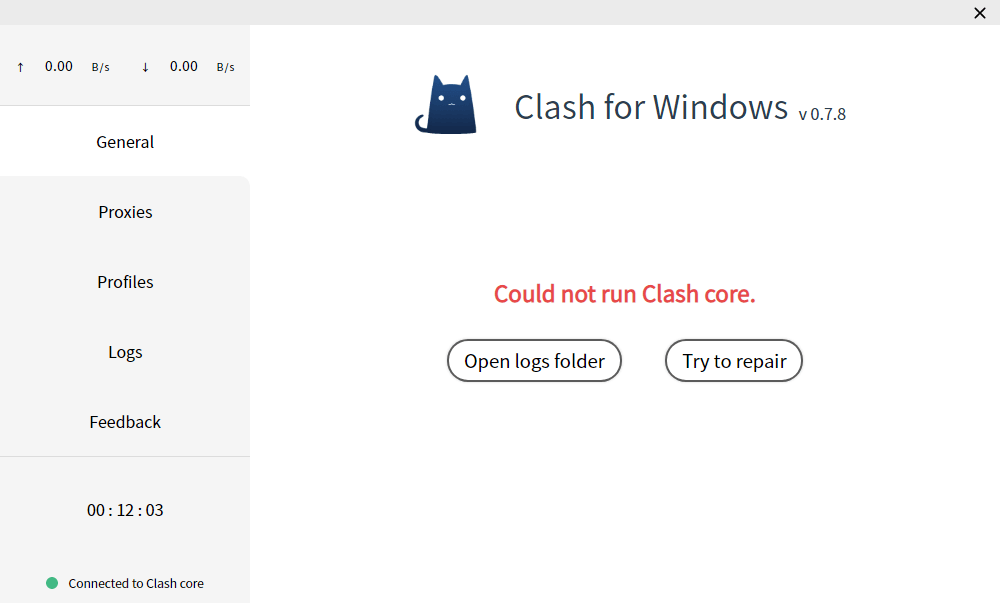

# 配置文件

## 格式

Clash 配置文件格式为[YAML]()，具体写法参考：https://github.com/Dreamacro/clash#config

CFW 启动的过程会使用到两个配置文件，分别是：

- `Home Directory/config.yaml`
- `Home Directory/profiles/xxxx.yaml`

### config.yaml

这是 Clash 的启动文件，位于`Home Directory`中，如果此文件有错，则 Clash 核心将无法启动，一般会出现如下界面：



::: danger
此文件关乎 Clash 核心是否能正常启动，如非必要，请勿更改
:::

### Profiles/xxxx.yaml

Profiles 文件夹下文件均由用户导入，CFW 统一生成的，一般命名为时间戳

这些文件可以不完整，通常只需要有：`proxies/proxy-groups/rules`三个字段组成即可：

```yaml
proxies:
  - name: Shadowsocks
    type: socks5
    server: 127.0.0.1
    port: 1080
proxy-groups:
  - name: Proxy
    type: select
    proxies:
      - Shadowsocks
rules:
  - "MATCH,DIRECT"
```

除此外，还可以添加`dns/hosts`字段，但在使用 CFW 时不建议添加

## 加载过程

CFW 启动流程如下：

1. 使用基础配置文件 config.yaml 启动 Clash 核心
2. 根据用户上次使用的配置文件（Profiles/xxxxx.yml）进行恢复
3. 恢复用户上次操作的策略情况

### 解读

步骤 1 完成后，Clash 会按照 config.yaml 设置启动

步骤 2 完成后，用户配置文件里的`proxies/proxy-providers/proxy-groups/rule-providers/rules/dns`这几个字段的内容会被替换到 Clash 里面，除了上面值几个字段，其他的内容均不会替换（这就是 Profiles 里配置文件可以不完整的原因）

### 原因

**之所以不进行全替换，是因为每一个配置文件所设定的端口号可能是不一样的，这样每次切换配置文件后，需要重新设置系统代理以及其他软件的代理端口，这显然太麻烦**

所以采用上面的方案，使得用户配置文件以 Plugin 的方式加载
如果需要修改端口号，只需要在 General 界面点击 Text Mode Edit 打开 config.yaml 文件编辑并保存即可，Clash for Windows 会在检测到文件变化后自动为你重启 Clash 核心
